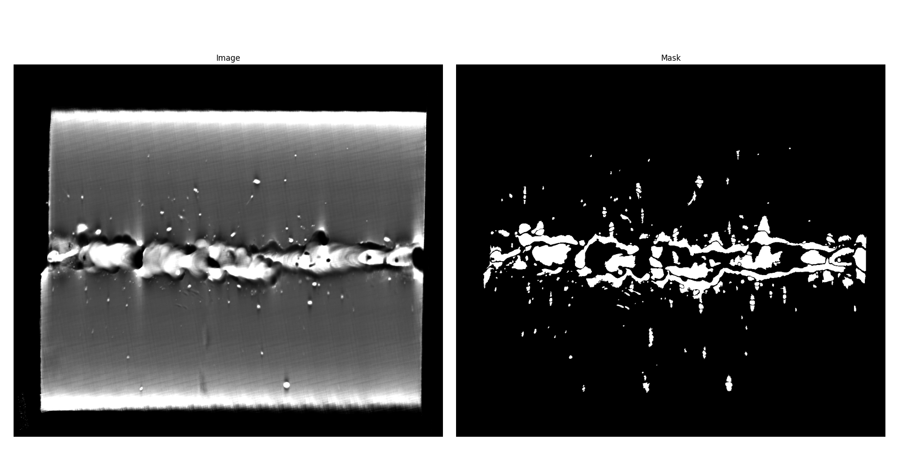
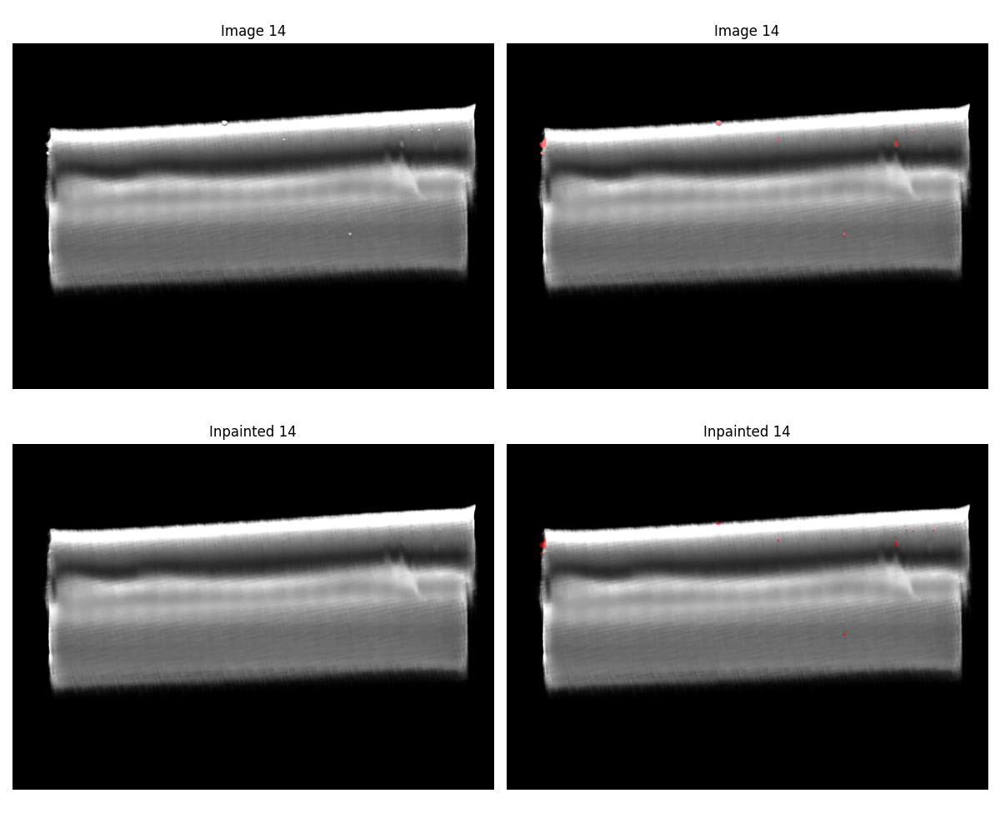
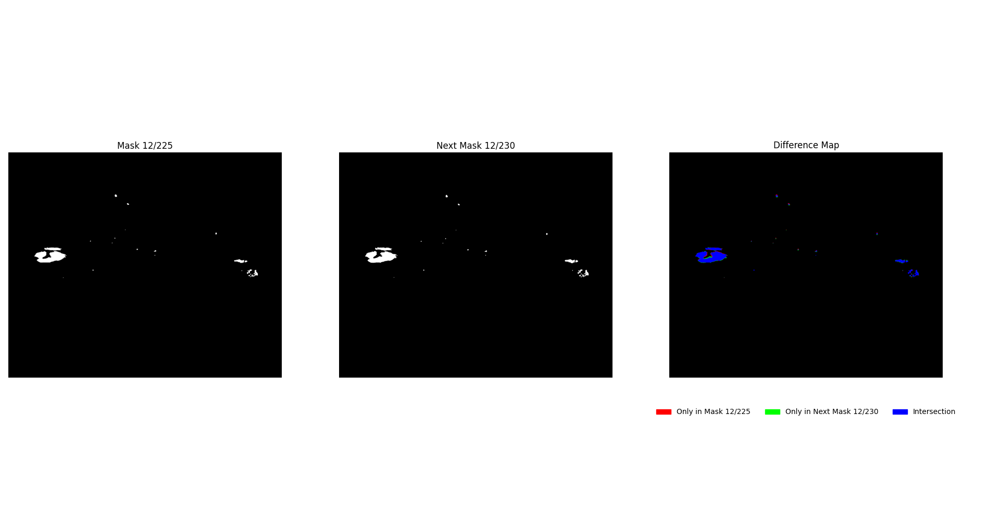
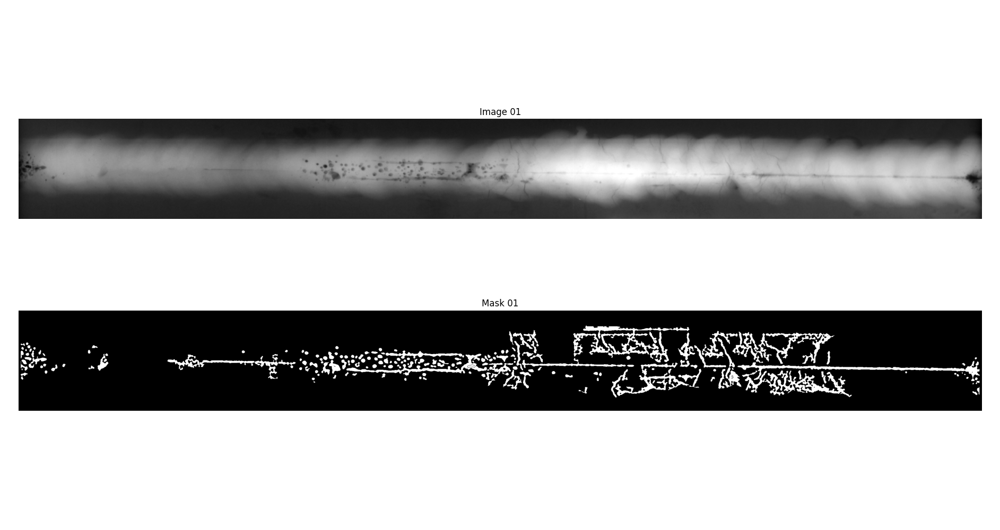
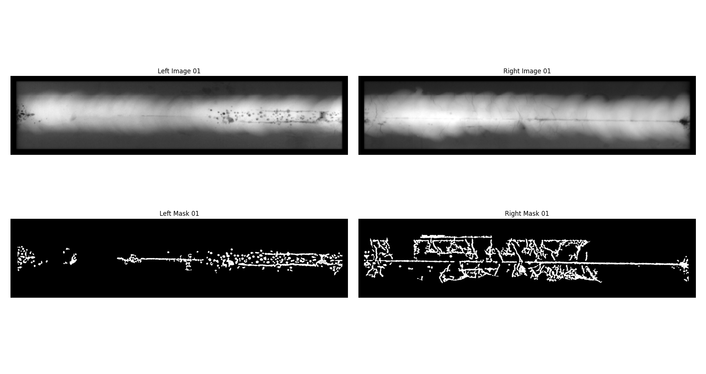

# Dataset-Expansion
This repository aims to extent dataset size for my thesis, the topic of which is anomaly detection within CT scans of welds using neural networks.

### Dataset Characteristics
- CT scans of welds - sliced to images
- Few slices are masked
- Only anomalous samples

## Considered Methods

### 1. Inpainting
Create synthetic normal samples using an inpainting algorithm (removing the defects). This method is effective only for small defects.

**Experimented with**
- Inpainting algorithm

- Inpainting radius

- Dilatation kernel

- Image size

**Results**
Only a couple of images were successfully inpainted. It seems like the defects included in the set are too complex or large for a true expansion of the set using inpainting.

### 2. Using Optical Flow
Optical flow takes advantage of sequential order of slices extracted from 3D CT views.

The flow (transformation) is calculated from a Ground Truth (GT) masked image and an unmasked (unlabeled) image. The computed flow is then applied to the GT mask, resulting in a propagated mask, which corresponds to the unlabeled image.

This process is effective only with slices that are near each other = there are no significant changes between them. This means that these images, as well as the masks, are very similar but not identical -- providing new data for the dataset.

**Results**
Using optical flow seems very effective for this dataset expansion. The drawback that comes to my mind is related to the core principle of this method -- the set will contain multiple very similar samples. At this moment, I am not sure if this would be a problem when using the dataset for the neural network or not.

### 3. Using Another Dataset
The goal of this method is to find a similar dataset that could be used in combination with the original one, resulting in a larger overall set.

Finding a similar dataset is not a simple task, as CT scanning is not as common for welds. Consequently, priority was given to finding a set of X-rays images of welds (since a CT slice is somewhat similar to an X-ray image).

**Results**
The best candidate that I have found is public [GDXray](https://domingomery.ing.puc.cl/material/gdxray/) dataset -- specifically the "Welds" portion (the set also contains some other categories, such as Nature, Baggages, etc.).

As seen above, the image is somewhat similar to the original set. Based on the images' format, they are also split in half so they better match the original dataset's format. Unfortunately, the set contains only a few masked images of the welds, but by splitting them, the additional size is doubled.

### 4. Why not GAN?
A GAN was also considered as a potential method. The problem I found is that, as far as I know, GANs are generally used for generating synthetic normal data -- they effectively learn the distribution of what a normal sample should look like and can replicate it quite well. In my case (due to the absence of normal data), I cannot train a GAN to produce such a samples.

Theoretically, a GAN could also be used to generate defected samples, but I my concerns are that in my case, the network would be very difficult (if even possible) to stabilize. I am not sure how well it could produce a relevant (realistic) data when the original set contains such a complex defects.

## Conclusion
The expansion is carried out primarily by the [Optical Flow Method](#2-using-optical-flow). Additionally, some samples are added through inpanting and by taking samples from the [GDXray](https://domingomery.ing.puc.cl/material/gdxray/) set, effectively increasing the original dataset size several times. The final count is determined by how many additional samples are masked using the fow for each regular GT sample.

